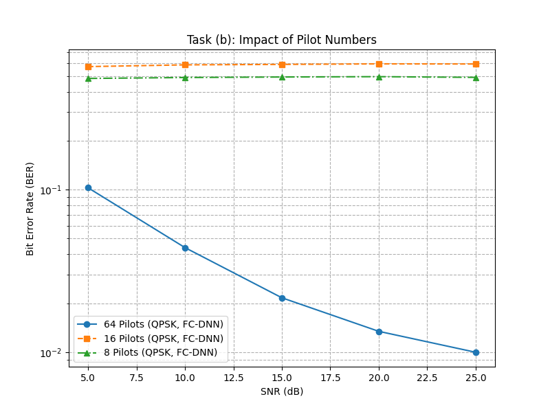
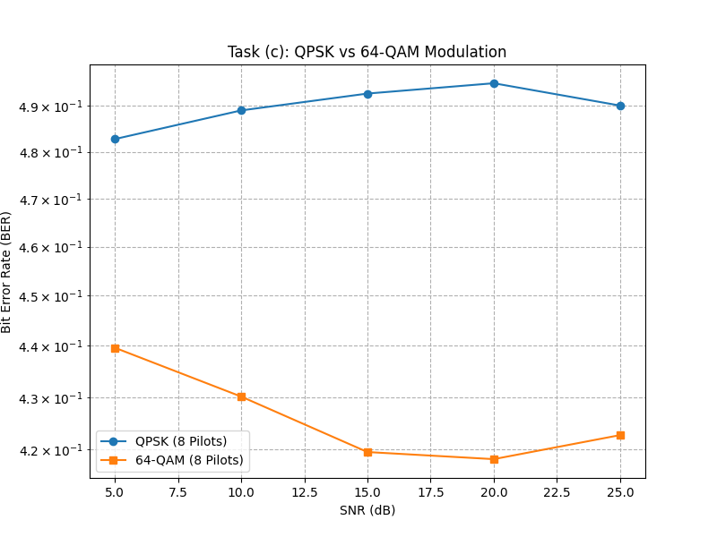
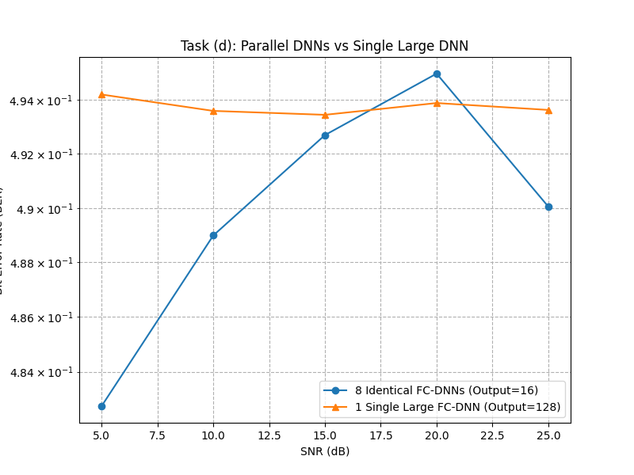

# Exercise 3.1: Learning-based Signal Detection for OFDM Systems

This repository provides the code for Exercise 3.1. Using Deep Learning (FC-DNN) to implicitly estimate the channel and recover transmitted bits in an OFDM system, based on the paper by Ye et al. 





## Environment Setup (Windows/RTX 4050)
The project is configured for Windows 10/11 with an NVIDIA RTX 4050 GPU for hardware acceleration:
1. **Create the virtual environment with the specific Python version:**
    ```bash
    conda create -n tensorflow python=3.9.19 -y
    ```

2. **Activate the environment:**
    ```bash
    conda activate tensorflow
    ```

3. **Install CUDA Toolkit via Conda:**
    ```bash
    conda install -c conda-forge cudatoolkit=11.2 cudnn=8.1.0
    ```

4. **Install all required packages via requirements.txt:**
   ```bash
   pip install -r requirements.txt
   ```

## Execution Workflow
1. cd to the DNN_Detection 
    ```bash
    cd DNN_Detection
    ```

2. Execute the 
    ```bash
    python Main.py
    ```
    to train the models (include b, c, d, only execute one time)
    
3. Execute the 
    ```bash
    python plot_main.py
    ```
    to plot compare chart


All Model saved to Model_b, Model_c, Model_d file
The H_dataset is downloaded from the following link: https://github.com/haoyye/OFDM_DNN.

## Acknowledgements
This project includes code referenced and modified from [le-liang/wcmlbook](https://github.com/le-liang/wcmlbook.git).
